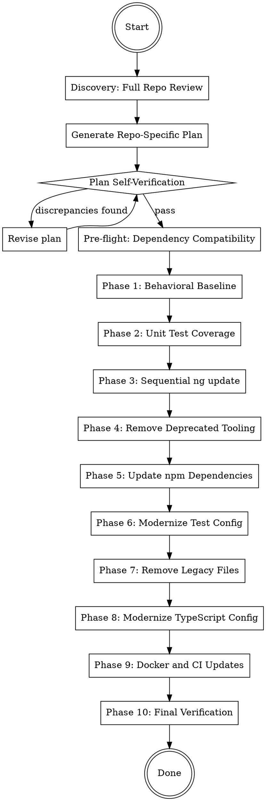

# Angular Latest Stable Upgrade Guide

## Overview

Phased migration strategy for upgrading Angular applications to the latest stable version. Angular requires upgrading **one major version at a time** using `ng update` schematics. Each phase has a verification gate before proceeding.

**Core principle:** Baseline first, sequential `ng update` one major at a time, deprecated tooling removal, dependency updates, config modernization, Docker/CI last. Never skip verification gates.

## When to Use

- Upgrading an Angular application across one or more major versions
- Removing deprecated tooling (Protractor, TSLint, karma-coverage-istanbul-reporter)
- Modernizing TypeScript/tsconfig for latest Angular
- Updating test configuration (Karma/Jasmine, or migrating to Jest)
- Updating Docker/CI for current Node LTS
- Any combination of the above

**When NOT to use:**
- Greenfield Angular projects (use `ng new` with latest)
- Non-Angular frontend upgrades (React, Vue, etc.)
- Minor/patch version bumps within the same major

## Phase Order



**Every phase ends with: build, test, commit.** Each phase gets its own commit for easy rollback.

---

## Discovery: Full Repository Review

**Before writing any plan, you MUST fully understand the repository.** Do not skip or shortcut this phase.

### Step 1: Understand the Architecture

Read and analyze the following (adapt to what exists in the repo):

- `package.json` — all dependencies with versions, scripts, engines
- `angular.json` — project config, builders, budgets, assets, styles, polyfills
- `tsconfig.json`, `tsconfig.app.json`, `tsconfig.spec.json` — TypeScript config
- `karma.conf.js` or `jest.config.ts` — test runner configuration
- `Dockerfile` — Node version, nginx version, build stages
- `docker-compose.yml` — if it exists
- `.github/workflows/` or CI config — build, test, deploy pipelines
- `src/main.ts` — bootstrap method (standalone vs NgModule)
- `src/app/app.module.ts` — if it exists (NgModule-based)
- `src/app/app.config.ts` — if it exists (standalone-based)
- `src/app/app-routing.module.ts` or `src/app/app.routes.ts` — routing config
- `src/polyfills.ts` — if it exists (legacy, removable since Angular 15)
- `src/test.ts` — if it exists (legacy test bootstrap, removable)
- `src/environments/` — environment configs
- `e2e/` — end-to-end test config (Protractor? Cypress? Playwright?)
- `tslint.json` — if it exists (deprecated, should be replaced with ESLint)
- `.browserslistrc` or `browserslist` in package.json — browser targets
- `.editorconfig` — code style

### Step 2: Map the Application Architecture

Document:
- **Bootstrap method:** NgModule (`platformBrowserDynamic().bootstrapModule()`) or Standalone (`bootstrapApplication()`)
- **Component style:** NgModule declarations or standalone components
- **Routing:** RouterModule.forRoot() or provideRouter()
- **HTTP:** HttpClientModule or provideHttpClient()
- **Forms:** ReactiveFormsModule, FormsModule, or both
- **State management:** NgRx, Akita, simple services, signals
- **UI framework:** Angular Material, PrimeNG, Bootstrap, Tailwind, custom
- **Third-party integrations:** Rich text editors (CKEditor, Quill), charting libs, file upload, etc.
- **Test framework:** Karma/Jasmine, Jest, Cypress, Playwright
- **Build system:** Webpack (legacy) or esbuild/application builder (modern)

### Step 3: Identify Current Versions and Upgrade Path

Create a version inventory and determine how many major versions to cross:

| Component | Current Version | Target Version | Majors to Cross |
|-----------|----------------|----------------|-----------------|
| @angular/* | ? | latest stable | ? |
| @angular/material | ? | latest stable | ? |
| @angular/cdk | ? | latest stable | ? |
| TypeScript | ? | (auto via ng update) | - |
| Node.js | ? | LTS (22.x) | ? |
| RxJS | ? | 7.8.x | ? |
| zone.js | ? | 0.15.x | ? |
| (each significant package) | ? | ? | ? |

**Use the Angular Update Guide:** Reference https://angular.dev/update-guide for version-specific migration steps and breaking changes.

### Step 4: Generate the Repo-Specific Upgrade Plan

Write a detailed, repo-specific upgrade plan to `docs/plans/YYYY-MM-DD-angular-XX-upgrade.md` that:

- References **actual file paths** in this repo
- Lists **exact dependency versions** currently in `package.json`
- Names **specific components, services, and modules** that need migration
- Identifies **repo-specific risks** (third-party package compatibility, custom webpack config, etc.)
- Follows the phase structure from this guide but tailored to what this repo actually uses
- Calculates the **exact number of `ng update` steps** needed (one per major version)

**Skip phases that don't apply.** If the repo doesn't use Protractor, skip that removal. If it's already on the latest TypeScript config patterns, skip Phase 8.

---

## Plan Self-Verification

**After generating the plan, you MUST verify it before proceeding.** Do not skip this step.

### Step 1: Find Discrepancies

Review the plan in totality and actively look for:
- Dependencies referenced that aren't in `package.json`
- Files referenced that don't exist
- `ng update` steps that skip a major version (must be sequential)
- Third-party packages that may not support the target Angular version
- Build config changes that don't match the actual `angular.json` structure
- Missing components or services that would be affected by breaking changes

### Step 2: Generate Verification Questions

Generate 3-5 verification questions that would expose errors in the plan. Examples:

- "Does the plan account for every file that imports from `@angular/http` (removed in v15)?"
- "Are there third-party packages with Angular version peer dependencies that would block `ng update`?"
- "Does the repo use the legacy Webpack builder or the modern application/esbuild builder?"
- "Are there lazy-loaded modules that need route config updates?"
- "Does the karma.conf.js reference packages that aren't in package.json?"

### Step 3: Answer Each Question Independently

For each question, **go back to the codebase** and verify. Do not answer from memory or assumption. Use grep, glob, and file reads to confirm.

### Step 4: Revise the Plan

Update the repo-specific plan based on findings. If no changes needed, explicitly state "Plan verified — no discrepancies found."

**Only proceed to implementation after this verification loop passes.**

---

## Pre-Flight: Dependency Compatibility

Before starting, check third-party package compatibility with the target Angular version.

```bash
# Check for peer dependency conflicts
npm ls 2>&1 | grep "ERESOLVE\|peer dep\|invalid"

# Check Angular update compatibility
npx ng update
```

**Common blockers:**
- Third-party UI libraries with Angular version peer deps (CKEditor, ngx-*, primeng)
- State management libraries (NgRx version must match Angular major)
- Custom builders or schematics with version constraints

If any package blocks the upgrade, determine if:
1. A compatible version exists (check npm/GitHub)
2. The package can be replaced (e.g., CKEditor 4 -> CKEditor 5)
3. The `--force` flag can safely bypass the peer dep (last resort)

---

## Phase 1: Behavioral Baseline

Before changing anything, establish what "working" looks like.

**If the app has E2E tests (Cypress/Playwright):**
- Run the full E2E suite and confirm all pass
- Commit any test fixes needed to get to green

**If no E2E tests exist:**
- Create a manual QA checklist covering every route and key user flows
- Document current behavior for critical features
- Consider adding Cypress/Playwright as part of this upgrade (optional)

**Always:**
- Run the existing unit test suite: `npm test` or `npx ng test --watch=false`
- Run the production build: `npm run build` or `npx ng build --configuration production`
- Document any pre-existing failures or warnings

### Verification Gate

```bash
npx ng build --configuration production
npx ng test --watch=false
```

All passing. Commit any baseline fixes.

---

## Phase 2: Expand Unit Test Coverage

Identify untested components and services. Add tests **in the current Angular version** so they pass now.

**Priority targets:**
- Components without `.spec.ts` files
- Services with complex logic or HTTP calls
- Interceptors/middleware (auth, error handling)
- Guards and resolvers
- Pipes with transformation logic

### Verification Gate

```bash
npx ng test --watch=false --code-coverage
```

All green. Commit new tests.

---

## Phase 3: Sequential `ng update` (One Major at a Time)

**Angular REQUIRES upgrading one major version at a time.** Each major version has automated schematics that apply code migrations. Skipping versions means missing these migrations.

### For Each Major Version Step (repeat N -> N+1 until target):

**Step 1: Update Angular core and CLI**

```bash
npx ng update @angular/core@{N+1} @angular/cli@{N+1} --force
```

The `--force` flag bypasses peer dependency warnings. This is often necessary because third-party packages lag behind Angular releases.

**What `ng update` does automatically:**
- Updates all `@angular/*` packages to the target major
- Updates `@angular-devkit/build-angular`
- Updates TypeScript to the required version
- Runs automated code migrations (schematics) for breaking changes

**Step 2: Update Angular Material (if used)**

```bash
npx ng update @angular/material@{N+1} --force
```

This also updates `@angular/cdk` to the matching version. `@angular/cdk` and `@angular/material` **must always be the same version** — never update one without the other.

**Step 3: Install and verify**

```bash
npm install
npx ng build --configuration production
npx ng test --watch=false
```

**Step 4: Review schematic changes**

Before committing, review the diff. `ng update` schematics auto-modify source files (templates, TypeScript, config). Common issues:
- Template control flow migration (`*ngIf` -> `@if`) may break custom components or third-party component wrappers
- TypeScript migrations may introduce new imports or change API calls
- `angular.json` modifications may alter build config in unexpected ways

```bash
git diff  # Review ALL changes before committing
```

**Step 5: Commit**

```bash
git add -A
git commit -m "chore: upgrade Angular {N} -> {N+1} via ng update schematics"
```

**Then repeat for the next major version.**

**Order matters:** Always update `@angular/core` + `@angular/cli` BEFORE `@angular/material`. Material depends on core — updating in reverse order causes version conflicts.

### Common `ng update` Schematics by Version

| Version | Key Automated Migrations |
|---------|------------------------|
| 14 -> 15 | Standalone component support, `RouterModule` -> `provideRouter` (optional), **Material MDC migration** (massive — see below) |
| 15 -> 16 | `DestroyRef`, required inputs signal, class-based guards -> functional guards |
| 16 -> 17 | Control flow (`@if`, `@for`, `@switch`), deferrable views |
| 17 -> 18 | **Builder migration (Webpack -> application/esbuild)**, `HttpClientModule` -> `provideHttpClient()` |
| 18 -> 19 | Incremental hydration, resource API |
| 19 -> 20 | `InjectFlags` removal, `TestBed.get` -> `TestBed.inject` |
| 20 -> 21 | `ngClass` -> `class` bindings, `ngStyle` -> `style`, `SimpleChanges` generic |

**Not all migrations are applied automatically.** Check the Angular Update Guide for manual steps required at each version.

### Angular Material MDC Migration (v14 -> v15)

If crossing the v14/v15 boundary, this is the **largest Material breaking change ever**. All Material components were rewritten to use MDC (Material Design Components) Web:

- Component selectors changed (e.g., `mat-raised-button` -> `mat-flat-button` in some cases)
- CSS class names changed (all `mat-` prefixes became `mdc-` internally)
- Custom CSS targeting Material internals will break
- Theming API changed from `@import` to `@use`:

```scss
// OLD (v14 and earlier)
@import '~@angular/material/theming';
@include mat-core();

// NEW (v15+)
@use '@angular/material' as mat;
```

- Density and typography APIs changed
- `mat-form-field` appearance options changed (`legacy` and `standard` removed, only `fill` and `outline` remain)

**The `ng update` schematic handles some of this automatically**, but custom styles targeting Material internals require manual fixes. Budget extra time for this step.

### Builder Migration: `browser` -> `application` (v17 -> v18)

If crossing the v17/v18 boundary, `ng update` migrates the builder in `angular.json`:

```json
// OLD
"builder": "@angular-devkit/build-angular:browser"

// NEW
"builder": "@angular-devkit/build-angular:application"
```

**Key impacts:**
- **Output path changes:** `dist/{app}/` becomes `dist/{app}/browser/` — update Docker `COPY` commands
- **`fileReplacements` may break:** The `application` builder handles environment files differently. Check that `environment.ts` / `environment.prod.ts` substitution still works
- **Custom Webpack config breaks entirely:** If the project uses `@angular-builders/custom-webpack`, it's incompatible with the `application` builder. Either stay on `browser` builder or remove custom webpack config
- **`main` key renamed to `browser`** in angular.json options
- **`polyfills` becomes an array** of strings instead of a file path
- **Server-side rendering** gets auto-configured if `@angular/ssr` is detected

**If the project has a complex custom Webpack setup**, you may need to stay on the `browser` builder temporarily and migrate webpack customizations to the `application` builder's plugin system separately.

### HttpClientModule Deprecation (v18+)

Angular 18+ deprecates module-based HTTP setup. Migrate:

```typescript
// OLD (NgModule-based)
imports: [HttpClientModule]

// NEW (standalone or NgModule)
// In app.module.ts providers:
providers: [provideHttpClient(withInterceptorsFromDi())]

// Or in standalone bootstrap:
bootstrapApplication(AppComponent, {
  providers: [provideHttpClient(withInterceptorsFromDi())]
});
```

`withInterceptorsFromDi()` preserves existing class-based interceptors. Without it, interceptors stop working.

### Guards and Resolvers: Class -> Functional (v15+)

Angular 15+ deprecated class-based guards in favor of functional guards:

```typescript
// OLD (class-based)
@Injectable({ providedIn: 'root' })
export class AuthGuard implements CanActivate {
  canActivate(): boolean { return this.authService.isLoggedIn(); }
}

// NEW (functional)
export const authGuard: CanActivateFn = () => {
  return inject(AuthService).isLoggedIn();
};
```

Class-based guards still work but will show deprecation warnings. The `ng update` schematic may migrate some automatically.

### Edge Cases

**Peer dependency conflicts during `ng update`:**
If `ng update` fails due to peer deps, try:
1. `--force` flag (usually sufficient)
2. Update the blocking package first: `npm install blocking-package@compatible-version`
3. Temporarily remove the blocking package, run `ng update`, then re-add it

**TypeScript version conflicts:**
`ng update` handles TypeScript automatically. If it doesn't, manually install the required version:
```bash
npm install typescript@~{version} --save-dev
npx tsc --version  # Verify
```

**RxJS compatibility:**
- Angular 13-16: RxJS 7.x required
- Angular 17+: RxJS 7.x still supported, RxJS 8 not yet required
- If on RxJS 6.x, run `npx ng update rxjs` before upgrading Angular

### Verification Gate

After **each** major version step:

```bash
npx ng build --configuration production
npx ng test --watch=false
```

Both must pass before proceeding to the next major version.

---

## Phase 4: Remove Deprecated Tooling

### Protractor (deprecated since 2023, removed from Angular CLI)

If the repo has Protractor:

```bash
# Remove packages
npm uninstall protractor @types/jasminewd2 jasmine-spec-reporter ts-node

# Remove e2e directory
rm -rf e2e/
```

In `angular.json`, remove the `"e2e"` architect target:
```json
"e2e": {
  "builder": "@angular-devkit/build-angular:protractor",
  ...
}
```

In `package.json`, remove `"e2e"` script.

**Note:** Keep `puppeteer` if it's used by `karma-chrome-launcher` for headless Chrome in unit tests.

### TSLint (deprecated since 2019, builder removed from Angular CLI)

If the repo has `tslint.json`:

```bash
# Remove package (if installed)
npm uninstall tslint codelyzer

# Remove config
rm tslint.json
```

In `angular.json`, remove the `"lint"` architect target if it uses `@angular-devkit/build-angular:tslint`.

In `package.json`, remove `"lint"` script.

**Replacement (optional, separate task):** `ng add @angular-eslint/schematics` to set up ESLint.

### karma-coverage-istanbul-reporter

If `karma.conf.js` references `karma-coverage-istanbul-reporter` but it's not in `package.json` (common ghost dependency):

```bash
# If it IS in package.json:
npm uninstall karma-coverage-istanbul-reporter
```

Replace with `karma-coverage` (see Phase 6).

### Verification Gate

```bash
npx ng build --configuration production
npx ng test --watch=false
```

---

## Phase 5: Update Remaining npm Dependencies

### Production Dependencies

| Package | Notes |
|---------|-------|
| `rxjs` | Stay on 7.8.x — RxJS 8 not required yet |
| `zone.js` | 0.15.x still valid; 0.16 optional |
| `tslib` | Update to latest 2.x |
| `bootstrap` | If on 4.x, update to 4.6.2 (latest 4.x). Note: Bootstrap 4 is EOL — consider 5.x as future work |
| `ckeditor4-angular` | CKEditor 4 is EOL (June 2023). Pin to working version; plan CKEditor 5 migration as future work |
| `moment` | If present, consider replacing with `date-fns` or native `Intl`/`Temporal` (moment is maintenance-only) |
| `file-saver` | Update to latest 2.x |

### Dev Dependencies

| Package | Notes |
|---------|-------|
| `@types/jasmine` | Match jasmine-core major |
| `@types/node` | Match your Node LTS major (22.x) |
| `jasmine-core` | Update to latest (6.x) |
| `karma` | Update to latest 6.x |
| `karma-chrome-launcher` | Update to latest 3.x |
| `karma-coverage` | Update to latest 2.x |
| `karma-jasmine` | Update to latest 5.x |
| `karma-jasmine-html-reporter` | Update to latest 2.x |
| `puppeteer` | Update to latest (24.x) — used for headless Chrome |

```bash
# Update all at once
npm install {package}@^{version} --save
npm install {package}@^{version} --save-dev
```

### Verification Gate

```bash
npm audit  # Check for vulnerabilities
npx ng build --configuration production
npx ng test --watch=false
```

---

## Phase 6: Modernize Test Configuration

### karma.conf.js: Replace deprecated coverage reporter

If using `karma-coverage-istanbul-reporter`, replace with `karma-coverage`:

```javascript
// OLD
require('karma-coverage-istanbul-reporter'),

// NEW
require('karma-coverage'),
```

```javascript
// OLD
coverageIstanbulReporter: {
  dir: require('path').join(__dirname, './coverage/{app-name}'),
  reports: ['html', 'lcovonly', 'text-summary'],
  fixWebpackSourcePaths: true
},

// NEW
coverageReporter: {
  dir: require('path').join(__dirname, './coverage/{app-name}'),
  reporters: [
    { type: 'html' },
    { type: 'lcovonly' },
    { type: 'text-summary' }
  ]
},
```

### Remove legacy test.ts bootstrap file

If `src/test.ts` exists (legacy test bootstrap), it can be removed since Angular 15+. The test polyfills are now configured directly in `angular.json`:

```json
"test": {
  "builder": "@angular-devkit/build-angular:karma",
  "options": {
    "polyfills": [
      "zone.js",
      "zone.js/testing"
    ]
  }
}
```

Remove `src/test.ts` and remove it from `tsconfig.spec.json`'s `files` array if referenced there.

### Jest Migration (Optional)

If migrating from Karma to Jest:

```bash
# Remove Karma
npm uninstall karma karma-chrome-launcher karma-coverage karma-jasmine karma-jasmine-html-reporter puppeteer

# Install Jest
npm install jest @angular-builders/jest @types/jest --save-dev
```

Update `angular.json` test builder:
```json
"test": {
  "builder": "@angular-builders/jest:run"
}
```

This is a significant change — consider as separate future work unless specifically requested.

### Verification Gate

```bash
npx ng test --watch=false
```

---

## Phase 7: Remove Legacy Files

### polyfills.ts (removable since Angular 15)

If `src/polyfills.ts` exists and only contains `import 'zone.js'`:

**Step 1:** Update `angular.json` build options:
```json
// OLD
"polyfills": ["src/polyfills.ts"]

// NEW
"polyfills": ["zone.js"]
```

**Step 2:** Remove from `tsconfig.app.json`'s `files` array:
```json
// OLD
"files": ["src/main.ts", "src/polyfills.ts"]

// NEW
"files": ["src/main.ts"]
```

**Step 3:** Delete `src/polyfills.ts`

**Edge case:** If `polyfills.ts` imports additional polyfills (e.g., `core-js`, `classlist.js`, `web-animations-js`), evaluate whether they're still needed for your browser targets. If targeting modern browsers only, they likely aren't.

### .browserslistrc Modernization

Update browser targets to modern browsers only:

```
last 2 Chrome versions
last 1 Firefox version
last 2 Edge major versions
last 2 Safari major versions
last 2 iOS major versions
Firefox ESR
```

Remove any IE references — Angular dropped IE support in v13.

### Verification Gate

```bash
npx ng build --configuration production
npx ng test --watch=false
```

---

## Phase 8: Modernize TypeScript Config

### tsconfig.json Updates

Angular's `ng update` schematics handle some of these automatically. Only change what hasn't been updated yet.

| Setting | Old Value | New Value | Notes |
|---------|-----------|-----------|-------|
| `target` | `"es5"` / `"es2015"` / `"es2017"` | `"ES2022"` | Angular 16+ requires ES2022 minimum |
| `module` | `"es2020"` / `"esnext"` | `"preserve"` | Modern Angular default |
| `moduleResolution` | `"node"` | `"bundler"` | Modern module resolution (Angular 17+) |
| `lib` | `["es2018", "dom"]` | `["ES2022", "dom"]` | Match target |
| `useDefineForClassFields` | `false` | Remove | Not needed unless you have property initializers depending on constructor injection order |
| `fullTemplateTypeCheck` | `true` | Remove | Deprecated — replaced by `strictTemplates` |

**Angular compiler options:**
```json
"angularCompilerOptions": {
  "strictInjectionParameters": true,
  "strictTemplates": true
}
```

`strictTemplates` replaces the deprecated `fullTemplateTypeCheck`. If enabling for the first time, expect template type errors that need fixing:
- Add `| null` or `| undefined` to template bindings
- Use `$any()` as a temporary escape hatch for untyped third-party bindings
- Fix `*ngFor` / `@for` trackBy type mismatches

**Keep `experimentalDecorators: true`** — still required by Angular for decorator-based DI.

### SCSS/Sass Processor

If the project uses SCSS:

- **`node-sass` is dead.** The esbuild `application` builder does not support it. Switch to `sass` (Dart Sass):
  ```bash
  npm uninstall node-sass
  npm install sass --save-dev
  ```

- **`::ng-deep` is deprecated** (since Angular 14) but still works. It will eventually be removed. Flag for future refactoring but don't block the upgrade on it.

- **`/deep/` and `>>>` are removed.** If these exist in stylesheets, replace with `::ng-deep` or refactor to avoid piercing shadow DOM.

- **`@import` is deprecated in Dart Sass.** Replace with `@use` and `@forward`:
  ```scss
  // OLD
  @import 'variables';

  // NEW
  @use 'variables' as vars;
  // Reference: vars.$my-variable
  ```

### Angular Budget Updates

After major upgrades, bundle sizes often change. Check and update budgets in `angular.json`:

```json
"budgets": [
  {
    "type": "initial",
    "maximumWarning": "2mb",
    "maximumError": "5mb"
  },
  {
    "type": "anyComponentStyle",
    "maximumWarning": "6kb",
    "maximumError": "10kb"
  }
]
```

If the build fails with budget errors after upgrading, either:
1. Investigate why the bundle grew (did a tree-shakable import become non-tree-shakable?)
2. Increase the budget if the growth is expected (new Material MDC components are larger)

### Verification Gate

```bash
npx ng build --configuration production
npx ng test --watch=false
```

If `strictTemplates` causes build failures, fix template type errors before proceeding.

---

## Phase 9: Docker and CI Updates

### Dockerfile

```dockerfile
# Build stage — use Node LTS
FROM node:22-alpine AS builder
WORKDIR /app
COPY package*.json ./
RUN npm ci
COPY . .
RUN npm run build -- --configuration production

# Production stage — use current nginx
FROM nginx:1.27-alpine
COPY --from=builder /app/dist/{app-name}/browser /usr/share/nginx/html
```

**Key updates:**
- Node version: use current LTS (22.x), **not** a non-LTS odd version (19, 21, 23)
- Use `node:22-alpine` for smaller image
- nginx: update to `1.27-alpine` (or latest stable)
- Use `npm ci` instead of `npm install` for reproducible builds
- **Output path:** Angular 17+ with the `application` builder outputs to `dist/{app-name}/browser/` (not `dist/{app-name}/`)

**Apple Silicon (M1/M2/M3):** If the build runs on ARM and any dependency has native bindings:
```dockerfile
FROM --platform=linux/amd64 node:22-alpine AS builder
```

### Runtime Environment Variable Injection

Many Angular Docker setups inject environment variables at container start time (not build time) using `sed` or `envsubst` on the built JavaScript files. This is because Angular bakes environment values into the bundle at build time, but production deploys need different values per environment.

**Common pattern (`start_container.sh`):**
```bash
#!/bin/bash
# Replace placeholders in built JS files with runtime env vars
sed -i "s|PLACEHOLDER_API_URL|${API_URL}|g" /usr/share/nginx/html/*.js
nginx -g 'daemon off;'
```

**If the output path changed** (from `dist/{app}/` to `dist/{app}/browser/`), update the `COPY` in the Dockerfile AND any `sed` paths in the startup script:

```dockerfile
# Make sure this matches the new output path
COPY --from=builder /app/dist/{app-name}/browser /usr/share/nginx/html
```

**If the project uses `environment.ts` file replacement** and migrated to the `application` builder, verify that `fileReplacements` in `angular.json` still works. The `application` builder handles this differently than the `browser` builder — test with both `ng serve` (dev) and `ng build --configuration production` (prod).

### CI Workflow Updates

**GitHub Actions:**
```yaml
- name: Checkout
  uses: actions/checkout@v4

- name: Setup Node
  uses: actions/setup-node@v4
  with:
    node-version: '22'
    cache: 'npm'
```

**Node version alignment:** Ensure CI, Docker, and local development all use the same Node LTS major version.

### Angular Persistent Build Cache

Angular 17+ uses a persistent build cache (`.angular/cache/`). In CI, this can cause stale builds:

```yaml
# Option 1: Cache it for speed
- name: Cache Angular build
  uses: actions/cache@v4
  with:
    path: .angular/cache
    key: angular-cache-${{ hashFiles('package-lock.json') }}

# Option 2: Disable it in CI (safer)
# Set in angular.json:
# "cli": { "cache": { "enabled": false } }
```

**macOS Tahoe bug:** Angular's persistent cache uses `lmdb` which has a known crash on macOS 15 (Tahoe). If developers hit segfaults, disable the cache in `angular.json`:

```json
"cli": {
  "cache": {
    "enabled": false
  }
}
```

### Verification Gate

```bash
# Clean build
rm -rf node_modules dist .angular
npm ci
npx ng build --configuration production
npx ng test --watch=false

# Docker build
docker build -t {app-name}-test .
```

---

## Phase 10: Final Verification

Clean slate rebuild from scratch:

```bash
# Clean everything
rm -rf node_modules dist .angular package-lock.json

# Fresh install
npm install

# Full production build
npx ng build --configuration production

# Full test suite
npx ng test --watch=false --code-coverage

# Serve locally and smoke test
npx ng serve
# Verify app loads, key features work, no console errors

# Security audit
npm audit

# Docker build
docker build -t {app-name}-test .

# Run Docker image and verify
docker run -p 8080:80 {app-name}-test
# Verify app loads at http://localhost:8080
```

**Expected:** Build succeeds, all tests pass, no security vulnerabilities, Docker image builds and serves correctly.

---

## Quick Reference: File Change Map

| File | What Changes |
|------|-------------|
| `package.json` | All dependency versions, remove deprecated scripts |
| `package-lock.json` | Regenerated |
| `angular.json` | Builder config, polyfills, remove e2e/lint targets, budget updates |
| `tsconfig.json` | `target`, `module`, `moduleResolution`, `lib`, Angular compiler options |
| `tsconfig.app.json` | Remove `polyfills.ts` from `files` |
| `tsconfig.spec.json` | Remove `test.ts` from `files` if referenced |
| `karma.conf.js` | Replace coverage reporter, update plugins |
| `src/polyfills.ts` | **Delete** — replaced by `"polyfills": ["zone.js"]` in angular.json |
| `src/test.ts` | **Delete** — replaced by polyfills in angular.json test config |
| `e2e/` | **Delete** — Protractor removed |
| `tslint.json` | **Delete** — TSLint deprecated |
| `Dockerfile` | Node LTS, nginx version, output path |
| `.github/workflows/*.yml` | Node version, checkout@v4, setup-node@v4 |
| `.browserslistrc` | Modern browsers only |
| `src/app/**/*.ts` | Automated migrations from `ng update` schematics |
| `src/app/**/*.html` | Control flow migration if applied (`*ngIf` -> `@if`, etc.) |

---

## Post-Upgrade Modernization (Future Work)

These are NOT part of the upgrade but should be documented as follow-up tickets:

### Standalone Components Migration
Angular strongly encourages standalone components over NgModules. If the app uses NgModule architecture, plan an incremental migration:
```bash
# Automated migration schematic
ng generate @angular/core:standalone
```
This is a large change — do it as a separate effort, not during the version upgrade.

### Signal-based Reactivity
Angular promotes signals over classic RxJS `BehaviorSubject` patterns. Migrate incrementally:
```typescript
// OLD
private data$ = new BehaviorSubject<Data[]>([]);

// NEW
private data = signal<Data[]>([]);
```

### Zoneless Change Detection
Angular 18+ supports zoneless change detection. Optional migration:
```bash
ng generate @angular/core:zoneless-migration
```
This removes the `zone.js` dependency but requires signal-based reactivity throughout.

### ESLint Setup
If TSLint was removed without a replacement:
```bash
ng add @angular-eslint/schematics
```

### EOL Dependencies
Flag for replacement in future tickets:
- **CKEditor 4** (EOL June 2023) -> CKEditor 5 or Quill
- **moment.js** (maintenance-only) -> `date-fns` or native `Intl`/`Temporal`
- **Bootstrap 4** (EOL) -> Bootstrap 5 or remove in favor of Angular Material layout

---

## Risk Register

| Risk | Mitigation |
|------|-----------|
| Third-party package blocks `ng update` with peer dep error | Use `--force` flag; update the blocking package first if possible |
| Skipping a major version misses automated migrations | Always upgrade one major at a time — never skip |
| `strictTemplates` breaks build with template type errors | Fix incrementally — use `$any()` as temporary escape hatch |
| Legacy Webpack builder not compatible with latest Angular | Migrate to `application` builder: `ng update` usually handles this automatically |
| `polyfills.ts` imports custom polyfills beyond `zone.js` | Audit imports before deleting — move needed polyfills to `angular.json` polyfills array |
| `karma-coverage-istanbul-reporter` referenced but not installed | Replace with `karma-coverage` in karma.conf.js |
| Angular persistent cache crashes on macOS Tahoe | Disable cache in `angular.json`: `"cli": { "cache": { "enabled": false } }` |
| Docker output path changed with `application` builder | Angular 17+ outputs to `dist/{app}/browser/` not `dist/{app}/` |
| Node version mismatch between CI, Docker, and local dev | Standardize on Node LTS (22.x) everywhere |
| RxJS 6.x still in use | Must upgrade to RxJS 7.x before Angular 13+ — run `npx ng update rxjs` |
| `test.ts` removal breaks test discovery | Ensure `angular.json` test config has `"polyfills": ["zone.js", "zone.js/testing"]` |
| Data providers not `static` in Jasmine 6 / Angular 21 | Refactor data providers to static methods |
| Material MDC migration (v15) breaks all custom Material CSS | Budget extra time — audit all custom styles targeting Material internals |
| `@angular/cdk` version doesn't match `@angular/material` | Always update together — `ng update @angular/material` handles both |
| Builder migration breaks custom Webpack config | Stay on `browser` builder or remove custom webpack; `application` builder uses different plugin system |
| `fileReplacements` breaks after builder migration | Test environment file substitution with both `ng serve` and `ng build --configuration production` |
| `HttpClientModule` removal breaks interceptors | Use `provideHttpClient(withInterceptorsFromDi())` to preserve class-based interceptors |
| `node-sass` fails with esbuild `application` builder | Replace with `sass` (Dart Sass): `npm uninstall node-sass && npm install sass --save-dev` |
| Runtime env injection (`sed` in start script) uses wrong path | Update paths after builder migration — output moves to `dist/{app}/browser/` |
| Bundle budget errors after upgrade | Material MDC components are larger — adjust budgets in angular.json if growth is expected |
| `@import` deprecated in Dart Sass | Replace with `@use`/`@forward` — `@import` still works but emits warnings |

## Common Mistakes

| Mistake | Fix |
|---------|-----|
| Trying to jump multiple major versions at once | Run `ng update` for each major version sequentially |
| Running `ng update` without `--force` and getting stuck on peer deps | Use `--force` — peer dep warnings are usually safe to bypass |
| Removing `puppeteer` when removing Protractor | Keep it if `karma-chrome-launcher` uses it for headless Chrome |
| Forgetting to update Docker output path after builder migration | Angular `application` builder outputs to `dist/{app}/browser/`, not `dist/{app}/` |
| Using Node odd-version (19, 21, 23) in Docker | Always use Node LTS (even versions: 18, 20, 22) |
| Enabling `strictTemplates` without fixing template errors | Fix or suppress errors before committing — broken builds block team |
| Removing `polyfills.ts` without updating `angular.json` | Move polyfill references to `angular.json`'s `polyfills` array first |
| Not running `npm install` after `ng update` | `ng update` modifies `package.json` but may not install — always follow with `npm install` |
| Committing with `git add -A` across phases | Add specific files per phase for atomic, rollback-friendly commits |
| Keeping deprecated `tslint.json` after removing TSLint | Delete the config file to avoid confusion |
| Using `npm install` instead of `npm ci` in Docker/CI | `npm ci` is faster and guarantees reproducible installs from lockfile |
| Ignoring `npm audit` results after upgrade | Run `npm audit` and resolve vulnerabilities before shipping |
| Removing `experimentalDecorators` from tsconfig | Angular still requires it for decorator-based DI — keep it |
| Updating `@angular/material` without `@angular/cdk` | They must be the same version — `ng update @angular/material` handles both |
| Not reviewing `ng update` schematic changes before committing | Schematics auto-modify templates and TS files — review diffs for correctness before committing |
| Custom CSS targeting `mat-` internal classes after MDC migration | All internal classes changed — audit custom Material styles |
| Removing `HttpClientModule` without `withInterceptorsFromDi()` | Interceptors silently stop working — use `provideHttpClient(withInterceptorsFromDi())` |
| Keeping `node-sass` with `application` builder | Incompatible — must switch to `sass` (Dart Sass) |
| Not updating `start_container.sh` paths after builder migration | Runtime env injection breaks if `sed` targets wrong output directory |
| Ignoring bundle budget failures | Investigate cause — don't just increase limits without understanding why the bundle grew |
| Skipping `fileReplacements` testing after builder migration | Environment file substitution may silently stop working |
