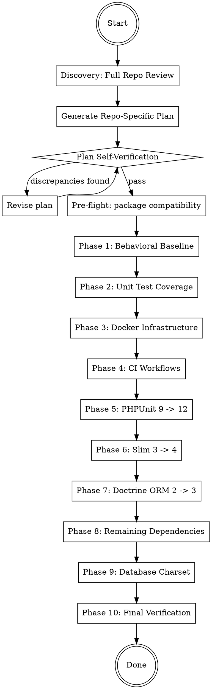

# PHP 8.5 Full Stack Upgrade Guide

## Overview

Phased migration strategy for upgrading PHP/Slim microservices to PHP 8.5 with modernized dependencies. Each phase has a verification gate before proceeding.

**Core principle:** Baseline first, infrastructure second, test framework third, app framework fourth, ORM fifth, then remaining deps. Never skip verification gates.

**Reference files (read when you reach the relevant phase):**
- `references/migration-patterns.md` -- all detailed code examples for Slim, Doctrine, JWT, and charset migrations
- `references/risks-and-mistakes.md` -- risk register and common mistake tables

## When to Use

- Upgrading a PHP application from 8.x to 8.5
- Migrating Slim 3 to Slim 4
- Migrating Doctrine ORM 2 to 3 / DBAL 3 to 4
- Upgrading PHPUnit 9/10/11 to 12
- Modernizing Docker infrastructure (MySQL 8.4, Redis 7+, RabbitMQ 4)
- Any combination of the above

**When NOT to use:**
- Greenfield projects (start with modern versions directly)
- Non-PHP upgrades
- Minor version bumps that don't cross major breaking changes

## Phase Order



**Every phase ends with: build, test, commit.** Each phase gets its own commit for easy rollback.

---

## Discovery: Full Repository Review

**Before writing any plan, you MUST fully understand the repository.** Do not skip or shortcut this phase.

### Step 1: Understand the Architecture

Read and analyze the following (adapt to what exists in the repo):

- `composer.json` -- all dependencies, PHP version constraint, autoload config
- `Dockerfile` -- base image, extensions, build steps
- `docker-compose.yml` -- all services, volumes, networks, environment variables
- `bootstrap.php` or equivalent -- how the app initializes
- `public/index.php` -- routing, middleware stack, app factory
- `config/` -- settings, container definitions, any config files
- `src/` -- scan the full directory structure, understand namespaces and layers
- `tests/` -- test structure, base test cases, what's covered
- `.github/workflows/` or CI config -- how tests and builds run
- `database/` -- migrations, seeds, base SQL
- `bin/` -- CLI scripts, queue consumers, task runners, cron entry points
- `.env` / `.env.example` -- environment variable defaults
- `cli-config.php` or `config/cli-config.php` -- Doctrine CLI configuration
- `migrations.php` / `migrations.yaml` -- Doctrine migrations configuration
- Any `dependencies.php`, `routes.php`, or similar wiring files

### Step 2: Map the Application Flow

Document (mentally or in notes):
- **Entry points:** HTTP routes, CLI commands, queue consumers
- **Middleware chain:** what runs on every request (auth, CORS, body parsing, etc.)
- **Container wiring:** how services are registered and injected
- **Database layer:** ORM setup, entity locations, migration tooling
- **External integrations:** message queues, caches, third-party APIs/SDKs
- **Internal packages:** any private/organizational packages with version constraints

### Step 3: Identify Current Versions

Create a version inventory:

| Component | Current Version | Target Version |
|-----------|----------------|----------------|
| PHP | ? | 8.5 |
| Framework (Slim) | ? | 4.x |
| Doctrine ORM | ? | 3.x |
| Doctrine DBAL | ? | 4.x |
| PHPUnit | ? | 12.x |
| MySQL/MariaDB | ? | MySQL 8.4 |
| Redis | ? | 7.4 |
| RabbitMQ | ? | 4-management |
| (each significant package) | ? | ? |

### Step 4: Generate the Repo-Specific Upgrade Plan

Write a detailed, repo-specific upgrade plan to `docs/plans/YYYY-MM-DD-php85-fullstack-upgrade.md` that:

- References **actual file paths and line numbers** in this repo
- Lists **exact dependency versions** currently in `composer.json`
- Names **specific classes** that need migration (controllers, middleware, entities, factories)
- Identifies **repo-specific risks** (internal packages, custom integrations, unusual patterns)
- Follows the phase structure from this guide but tailored to what this repo actually uses

**Skip phases that don't apply.** If the repo doesn't use Doctrine, skip Phase 7. If it's already on PHPUnit 12, skip Phase 5. The plan should reflect reality, not the template.

---

## Plan Self-Verification

**After generating the plan, you MUST verify it before proceeding.** Do not skip this step.

### Step 1: Find Discrepancies

Review the plan in totality and actively look for:
- Files referenced that don't exist
- Dependencies listed that aren't in `composer.json`
- Migration patterns that don't match the repo's actual code patterns
- Phases included that don't apply to this repo
- Missing files that should be modified but aren't listed
- Version assumptions that conflict with actual `composer.json` constraints

### Step 2: Generate Verification Questions

Generate 3-5 verification questions that would expose errors in the plan. Examples:

- "Does the plan account for every file that imports `Slim\Http\Request`?"
- "Are there queue consumers or CLI entry points that also need Slim 4 / PSR-7 changes?"
- "Does the repo actually use Doctrine annotations, or is it already on attributes?"
- "Are there integration tests that connect to the database and would break with MySQL 8.4?"
- "Does the container definition cover every service the app registers?"

### Step 3: Answer Each Question Independently

For each question, **go back to the codebase** and verify. Do not answer from memory or assumption. Use grep, glob, and file reads to confirm.

### Step 4: Revise the Plan

Update the repo-specific plan based on findings. If no changes needed, explicitly state "Plan verified -- no discrepancies found."

**Only proceed to implementation after this verification loop passes.**

---

## Pre-Flight: Internal Package Compatibility

Before starting, audit all private/internal packages for PHP 8.5 compatibility.

```bash
docker compose exec {app} composer why-not php 8.5
```

If any internal packages require `php: <8.5`, file separate PRs in those repos first. These are blockers.

---

## Phase 1: Behavioral Baseline (Newman/Postman)

Before changing anything, create regression tests that exercise all HTTP endpoints.

- **Create a Newman/Postman collection** covering every route (happy path + error cases)
- **Generate JWT tokens in pre-request scripts** -- never hard-code tokens
- **Chain requests** -- POST creates, GET retrieves, use collection variables to pass data between requests
- **Run against current codebase** -- all tests must pass before any upgrades begin

This collection becomes your behavioral parity check after each phase.

### Verification Gate

```bash
docker compose exec {app} npx newman run tests/postman/*.json --env-var "base_url=http://localhost:8080"
```

All requests pass. Commit the collection.

---

## Phase 2: Expand Unit Test Coverage

Identify untested classes and add tests **in the current PHPUnit version** so they pass now.

**Priority targets:** Controllers without tests, middleware (auth, validation), entities without hydration/serialization tests, services with complex logic.

### Verification Gate

```bash
docker compose exec {app} vendor/bin/phpunit --coverage-text
```

All green. Commit new tests.

---

## Phase 3: Docker Infrastructure

**Target versions:** PHP 8.5, MySQL 8.4, Redis 7.4, RabbitMQ 4

Update `Dockerfile` to `php:8.5-fpm-alpine3.21` with `apk upgrade --no-cache` for CVE patching. Update `docker-compose.yml` services: MySQL 8.4 (with `--lower_case_table_names=1 --default-authentication-plugin=mysql_native_password`), Redis 7.4, RabbitMQ 4-management.

Key points:
- Use `MYSQL_PASSWORD` (not `MYSQL_PASS`)
- Add MySQL healthcheck and `depends_on: condition: service_healthy`
- Add `platform: linux/amd64` for Apple Silicon if needed
- Ensure `mkdir -p /app/cache/doctrine/proxy && chown -R www-data:www-data /app/cache` in Dockerfile
- Add `/app/cache/` to `.gitignore` and `.dockerignore`
- PECL extensions (redis, xdebug) may need rebuild/beta versions for PHP 8.5

### Verification Gate

```bash
docker compose down -v
docker compose build --no-cache {app}
docker compose up -d
docker compose exec {app}-mysql mysqladmin ping --wait=30 -h localhost
docker compose logs {app}-mysql 2>&1 | tail -20
```

---

## Phase 4: CI Workflow Updates

Update GitHub Actions (or equivalent) to PHP 8.5: `shivammathur/setup-php@v2` with `php-version: '8.5'`, `actions/checkout@v4`.

### Verification Gate

Verify Docker builds and extensions compile (pdo, redis, xdebug, etc.).

---

## Phase 5: PHPUnit 9 -> 12

### phpunit.xml

Remove deprecated attributes: `backupGlobals`, `backupStaticAttributes`, `convertErrorsToExceptions`, `convertNoticesToExceptions`, `convertWarningsToExceptions`, `processIsolation`, `stopOnFailure`, `verbose`. Replace `<coverage>` with `<source>`. Add `cacheDirectory=".phpunit.cache"`.

### composer.json

```json
"phpunit/phpunit": "^12.0"
```

### Test File Migration Table

| Pattern | Before | After |
|---------|--------|-------|
| Mock methods | `setMethods(['foo'])` | `onlyMethods(['foo'])` |
| Return values | `will($this->returnValue(x))` | `willReturn(x)` |
| Group annotation | `@group name` | `#[Group('name')]` |
| Test annotation | `@test` | `#[Test]` |
| Data provider | `@dataProvider methodName` | `#[DataProvider('methodName')]` |
| Depends | `@depends testFoo` | `#[Depends('testFoo')]` |
| Type hints | `\PHPUnit_Framework_MockObject_MockObject` | `MockObject` |
| Stubs vs mocks | `createMock()` everywhere | `createStub()` for deps without expectations |
| File assertions | `assertFileNotExists()` | `assertFileDoesNotExist()` |
| setUp/tearDown | No return type | Must declare `: void` return type |
| Exception testing | `@expectedException` | `$this->expectException(Foo::class)` |

**Mock vs Stub rule:** PHPUnit 12 issues notices for mock objects without expectations. Use `createStub()` for injected dependencies that aren't being verified. Use `createMock()` only when setting expectations with `expects()`. Alternatively, add `#[\PHPUnit\Framework\Attributes\AllowMockObjectsWithoutExpectations]` to the test class.

**Data providers must be `static` in PHPUnit 12.** Refactor any that reference `$this`.

### Verification Gate

```bash
docker compose down -v
docker compose build --no-cache {app}
docker compose up -d
docker compose exec {app} composer install
docker compose exec {app} vendor/bin/phpunit
```

All green, no deprecation notices. Commit.

---

## Phase 6: Slim 3 -> Slim 4 Migration

This is typically the largest change. It touches bootstrap, container, routing, middleware, controllers, and tests.

### composer.json Changes

**Remove:**
```json
"slim/slim": "^3.x"
```

**Add:**
```json
"slim/slim": "^4.0",
"slim/psr7": "^1.7",
"php-di/php-di": "^7.0",
"php-di/slim-bridge": "^3.4"
```

### Migration Patterns

This phase covers 11 migration patterns plus test updates. The patterns address container replacement (Pimple to PHP-DI), service definition rewrites, app bootstrap changes, middleware conversion to PSR-15, controller updates to PSR-7 interfaces, route callable format changes, body parsing middleware addition, route group syntax, custom error handler replacement, CORS middleware, and CLI/queue entry point updates.

See `references/migration-patterns.md` section [Slim 3 to Slim 4 Patterns] for all code examples.

**Critical reminders:**
- Add `$app->addBodyParsingMiddleware()` or `getParsedBody()` returns null
- Inject `ResponseFactoryInterface` in middleware -- never `new Response()` directly
- Audit `bin/` scripts and queue consumers, not just `public/index.php`
- Remove `notFoundHandler`/`notAllowedHandler` closures -- Slim 4 error middleware replaces them

### Verification Gate

```bash
docker compose down -v
docker compose build --no-cache {app}
docker compose up -d
docker compose exec {app} composer update
docker compose exec {app} vendor/bin/phpunit          # Unit tests
# Run Newman collection for behavioral parity
docker compose exec {app} npx newman run tests/postman/*.json
```

---

## Phase 7: Doctrine ORM 2 -> 3 / DBAL 3 -> 4

### composer.json Changes

```json
"doctrine/orm": "^3.4",
"doctrine/dbal": "^4.0",
"doctrine/migrations": "^3.9",
"gedmo/doctrine-extensions": "^3.17"
```

**Remove** (no longer needed with ORM 3 attribute-based mapping):
```json
"doctrine/annotations": "2.0"
```

### Migration Patterns

This phase covers 9 migration patterns: EntityManager creation with explicit Configuration and PhpFilesAdapter caching, annotations-to-attributes conversion, migration file platform check removal, Gedmo extensions update, PSR-6 caching setup, Doctrine CLI config, data-fixtures compatibility, getReference class-string requirement, and raw SQL Statement API changes.

See `references/migration-patterns.md` section [Doctrine ORM 2 to 3 / DBAL 3 to 4 Patterns] for all code examples.

**Critical reminders:**
- DBAL 4: `DriverManager::getConnection()` no longer accepts a `Configuration` second param
- DBAL 4: `Statement::executeQuery()` takes zero args -- params are silently dropped. Use `Connection::executeQuery()` or `Connection::executeStatement()` instead. Grep for `->prepare(` to audit.
- Add `'serverVersion' => '8.4'` to connection params
- Use `PhpFilesAdapter` (prod) + `NullAdapter` (dev) instead of Redis for Doctrine cache

### Verification Gate

```bash
docker compose down -v
docker compose build --no-cache {app}
docker compose up -d
docker compose exec {app} composer update
docker compose exec {app} vendor/bin/doctrine-migrations migrate --no-interaction
docker compose exec {app} vendor/bin/phpunit
```

---

## Phase 8: Remaining Dependencies

### Common Upgrades

| Package | Target | Notes |
|---------|--------|-------|
| `guzzlehttp/guzzle` | `^7.9` | Generally backward compatible |
| `predis/predis` | `^2.3` | Breaking: check if used directly or transitively |
| `symfony/*` | `^7.2` | Check component version alignment |
| `squizlabs/php_codesniffer` | `^3.11` | No breaking changes |
| `monolog/monolog` | `^3` | Handler/formatter API changes |
| `firebase/php-jwt` | `^6.11` | Pin to v6 -- do NOT upgrade to v7 (token length incompatibility in QA) |
| `google/cloud-logging` | `^1.29` | Generally backward compatible |

### Breaking Change Watchlist

- **Predis 1.x -> 2.x**: Connection params changed, some method signatures differ. If used only transitively, verify adapter compatibility or replace with `symfony/cache`
- **Firebase JWT**: Pin to `^6.11`. Do NOT upgrade to v7 -- token length constraints in QA environments cause failures

### JWT Middleware Replacement

If the repo uses `tuupola/slim-jwt-auth`, `tuupola/branca-middleware`, or any `jimtools/*` JWT packages, remove them and replace with a custom PSR-15 middleware using `firebase/php-jwt` directly. These packages are Slim 3-coupled or unmaintained.

See `references/migration-patterns.md` section [JWT Middleware Replacement Pattern] for the full implementation.

### Verification Gate

```bash
docker compose down -v
docker compose build --no-cache {app}
docker compose up -d
docker compose exec {app} composer update
docker compose exec {app} composer audit  # Zero vulnerabilities expected
docker compose exec {app} vendor/bin/phpunit
```

---

## Phase 9: Database Charset Standardization

MySQL 8.4 defaults to `utf8mb4`. Standardize your database to match. Create a Doctrine migration to ALTER each table, update base SQL files, and change the connection config charset to `utf8mb4`.

See `references/migration-patterns.md` section [Database Charset Migration Pattern] for the migration template, index length warnings, and environment variable checklist.

**Key concern:** `utf8mb4` uses 4 bytes/char. Verify `ROW_FORMAT` is `DYNAMIC` (MySQL 8.4 default) -- `COMPACT` format has a 767-byte index prefix limit that breaks `VARCHAR(255)` indexes.

---

## Phase 10: Final Verification

Tear down everything and rebuild from scratch to prove a clean environment works:

```bash
# Clean slate
docker compose down -v
docker compose build --no-cache {app}
docker compose up -d

# Install deps and run migrations from scratch
docker compose exec {app} composer install
docker compose exec {app} vendor/bin/doctrine-migrations migrate --no-interaction

# Full test suite
docker compose exec {app} vendor/bin/phpunit --coverage-text

# Behavioral regression (Newman)
docker compose exec {app} npx newman run tests/postman/*.json

# Code standards
docker compose exec {app} vendor/bin/phpcs -p --standard=phpcs.xml src

# Security audit
docker compose exec {app} composer audit

# PHP 8.5 deprecation check
docker compose exec {app} php -r "error_reporting(E_ALL); require 'vendor/autoload.php'; require 'bootstrap.php';"

# Docker image security (if using Docker Scout)
docker scout cves {app} --only-severity critical,high
```

**Expected:** All green, zero vulnerabilities, no deprecation notices.

---

## Quick Reference: File Change Map

| File | What Changes |
|------|-------------|
| `Dockerfile` | PHP version, Alpine version, `apk upgrade` |
| `docker-compose.yml` | MySQL 8.4, Redis 7.4, RabbitMQ 4 |
| `.github/workflows/*.yml` | PHP version, `actions/checkout@v4` |
| `phpunit.xml` | PHPUnit 12 schema, remove deprecated attrs, `<source>` replaces `<coverage>` |
| `composer.json` | All dependency versions |
| `bootstrap.php` | PHP-DI container builder |
| `config/container.php` | **New** -- PHP-DI service definitions |
| `config/settings.php` | Remove `'settings'` nesting if present (Slim 4) |
| `public/index.php` | Slim 4 bridge, body parsing, PSR-15 middleware, error middleware |
| `src/Controllers/*.php` | PSR-7 interfaces, remove `withJson()` |
| `src/Middleware/*.php` | PSR-15 `MiddlewareInterface`, inject `ResponseFactoryInterface` |
| `src/dependencies.php` | **Delete** -- replaced by `config/container.php` |
| `src/Factories/EntityManagerFactory.php` | ORM 3 API, DBAL 4 `DriverManager`, `utf8mb4` charset |
| `database/migrations/*.php` | Remove `$this->abortIf()` platform checks (DBAL 4) |
| `database/base.sql` | `utf8mb4` default charset |
| `tests/**/*.php` | PHPUnit 12 patterns, PSR-7 mocks, `StreamInterface` |

---

## Risks and Common Mistakes

See `references/risks-and-mistakes.md` for the full risk register and common mistakes tables.
