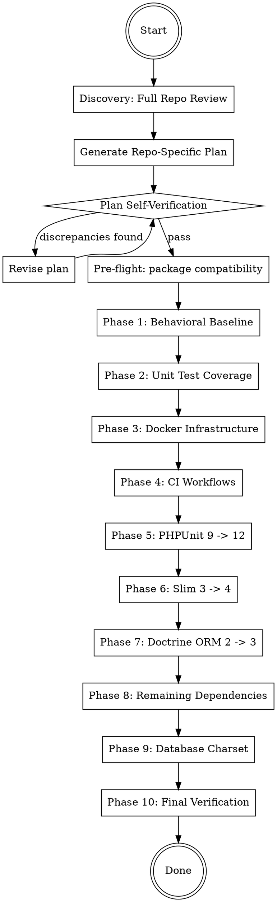

# PHP 8.5 Full Stack Upgrade Guide

## Overview

Phased migration strategy for upgrading PHP/Slim microservices to PHP 8.5 with modernized dependencies. Each phase has a verification gate before proceeding.

**Core principle:** Baseline first, infrastructure second, test framework third, app framework fourth, ORM fifth, then remaining deps. Never skip verification gates.

## When to Use

- Upgrading a PHP application from 8.x to 8.5
- Migrating Slim 3 to Slim 4
- Migrating Doctrine ORM 2 to 3 / DBAL 3 to 4
- Upgrading PHPUnit 9/10/11 to 12
- Modernizing Docker infrastructure (MySQL 8.4, Redis 7+, RabbitMQ 4)
- Any combination of the above

**When NOT to use:**
- Greenfield projects (start with modern versions directly)
- Non-PHP upgrades
- Minor version bumps that don't cross major breaking changes

## Phase Order



**Every phase ends with: build, test, commit.** Each phase gets its own commit for easy rollback.

---

## Discovery: Full Repository Review

**Before writing any plan, you MUST fully understand the repository.** Do not skip or shortcut this phase.

### Step 1: Understand the Architecture

Read and analyze the following (adapt to what exists in the repo):

- `composer.json` — all dependencies, PHP version constraint, autoload config
- `Dockerfile` — base image, extensions, build steps
- `docker-compose.yml` — all services, volumes, networks, environment variables
- `bootstrap.php` or equivalent — how the app initializes
- `public/index.php` — routing, middleware stack, app factory
- `config/` — settings, container definitions, any config files
- `src/` — scan the full directory structure, understand namespaces and layers
- `tests/` — test structure, base test cases, what's covered
- `.github/workflows/` or CI config — how tests and builds run
- `database/` — migrations, seeds, base SQL
- `bin/` — CLI scripts, queue consumers, task runners, cron entry points
- `.env` / `.env.example` — environment variable defaults
- `cli-config.php` or `config/cli-config.php` — Doctrine CLI configuration
- `migrations.php` / `migrations.yaml` — Doctrine migrations configuration
- Any `dependencies.php`, `routes.php`, or similar wiring files

### Step 2: Map the Application Flow

Document (mentally or in notes):
- **Entry points:** HTTP routes, CLI commands, queue consumers
- **Middleware chain:** what runs on every request (auth, CORS, body parsing, etc.)
- **Container wiring:** how services are registered and injected
- **Database layer:** ORM setup, entity locations, migration tooling
- **External integrations:** message queues, caches, third-party APIs/SDKs
- **Internal packages:** any private/organizational packages with version constraints

### Step 3: Identify Current Versions

Create a version inventory:

| Component | Current Version | Target Version |
|-----------|----------------|----------------|
| PHP | ? | 8.5 |
| Framework (Slim) | ? | 4.x |
| Doctrine ORM | ? | 3.x |
| Doctrine DBAL | ? | 4.x |
| PHPUnit | ? | 12.x |
| MySQL/MariaDB | ? | MySQL 8.4 |
| Redis | ? | 7.4 |
| RabbitMQ | ? | 4-management |
| (each significant package) | ? | ? |

### Step 4: Generate the Repo-Specific Upgrade Plan

Write a detailed, repo-specific upgrade plan to `docs/plans/YYYY-MM-DD-php85-fullstack-upgrade.md` that:

- References **actual file paths and line numbers** in this repo
- Lists **exact dependency versions** currently in `composer.json`
- Names **specific classes** that need migration (controllers, middleware, entities, factories)
- Identifies **repo-specific risks** (internal packages, custom integrations, unusual patterns)
- Follows the phase structure from this guide but tailored to what this repo actually uses

**Skip phases that don't apply.** If the repo doesn't use Doctrine, skip Phase 7. If it's already on PHPUnit 12, skip Phase 5. The plan should reflect reality, not the template.

---

## Plan Self-Verification

**After generating the plan, you MUST verify it before proceeding.** Do not skip this step.

### Step 1: Find Discrepancies

Review the plan in totality and actively look for:
- Files referenced that don't exist
- Dependencies listed that aren't in `composer.json`
- Migration patterns that don't match the repo's actual code patterns
- Phases included that don't apply to this repo
- Missing files that should be modified but aren't listed
- Version assumptions that conflict with actual `composer.json` constraints

### Step 2: Generate Verification Questions

Generate 3-5 verification questions that would expose errors in the plan. Examples:

- "Does the plan account for every file that imports `Slim\Http\Request`?"
- "Are there queue consumers or CLI entry points that also need Slim 4 / PSR-7 changes?"
- "Does the repo actually use Doctrine annotations, or is it already on attributes?"
- "Are there integration tests that connect to the database and would break with MySQL 8.4?"
- "Does the container definition cover every service the app registers?"

### Step 3: Answer Each Question Independently

For each question, **go back to the codebase** and verify. Do not answer from memory or assumption. Use grep, glob, and file reads to confirm.

### Step 4: Revise the Plan

Update the repo-specific plan based on findings. If no changes needed, explicitly state "Plan verified — no discrepancies found."

**Only proceed to implementation after this verification loop passes.**

---

## Pre-Flight: Internal Package Compatibility

Before starting, audit all private/internal packages for PHP 8.5 compatibility.

```bash
docker compose exec {app} composer why-not php 8.5
```

If any internal packages require `php: <8.5`, file separate PRs in those repos first. These are blockers.

---

## Phase 1: Behavioral Baseline (Newman/Postman)

Before changing anything, create regression tests that exercise all HTTP endpoints.

- **Create a Newman/Postman collection** covering every route (happy path + error cases)
- **Generate JWT tokens in pre-request scripts** — never hard-code tokens
- **Chain requests** — POST creates, GET retrieves, use collection variables to pass data between requests
- **Run against current codebase** — all tests must pass before any upgrades begin

This collection becomes your behavioral parity check after each phase.

### Verification Gate

```bash
docker compose exec {app} npx newman run tests/postman/*.json --env-var "base_url=http://localhost:8080"
```

All requests pass. Commit the collection.

---

## Phase 2: Expand Unit Test Coverage

Identify untested classes and add tests **in the current PHPUnit version** so they pass now.

**Priority targets:**
- Controllers without tests
- Middleware (auth, validation)
- Entities without hydration/serialization tests
- Services with complex logic

### Verification Gate

```bash
docker compose exec {app} vendor/bin/phpunit --coverage-text
```

All green. Commit new tests.

---

## Phase 3: Docker Infrastructure

**Target versions:** PHP 8.5, MySQL 8.4, Redis 7.4, RabbitMQ 4

### Dockerfile

```dockerfile
FROM php:8.5-fpm-alpine3.21 AS base

# Patch Alpine CVEs before installing packages
RUN apk upgrade --no-cache
```

### docker-compose.yml

| Service | Before | After |
|---------|--------|-------|
| Database | MariaDB 10.x (EOL) | MySQL 8.4 |
| Redis | 3.x / 6.x | 7.4 |
| RabbitMQ | 3-management | 4-management |

**MySQL 8.4 service:**

```yaml
  {app}-mysql:
    image: mysql:8.4
    command: --lower_case_table_names=1 --default-authentication-plugin=mysql_native_password
    environment:
      MYSQL_ROOT_PASSWORD: ${MYSQL_ROOT_PASSWORD}
      MYSQL_DATABASE: ${MYSQL_DATABASE}
      MYSQL_USER: ${MYSQL_USER}
      MYSQL_PASSWORD: ${MYSQL_PASSWORD}
```

**Key migration notes:**
- Environment variable: ensure `MYSQL_PASSWORD` (not `MYSQL_PASS` — common typo)
- Add `--default-authentication-plugin=mysql_native_password` for tool compatibility
- `lower_case_table_names` must be set at init time (via `command:`)
- If migrating from MariaDB, drop the old volume (`docker compose down -v`) for a clean init

**Apple Silicon (M1/M2/M3):** If any service image lacks ARM builds, add `platform: linux/amd64`:

```yaml
  {app}-mysql:
    image: mysql:8.4
    platform: linux/amd64  # Only if needed for ARM compatibility
```

**MySQL healthcheck** — prevent commands from running before MySQL is ready:

```yaml
  {app}-mysql:
    healthcheck:
      test: ["CMD", "mysqladmin", "ping", "-h", "localhost"]
      interval: 5s
      timeout: 5s
      retries: 10

  {app}:
    depends_on:
      {app}-mysql:
        condition: service_healthy
```

**Redis and RabbitMQ:**

```yaml
  redis:
    image: redis:7.4

  amqp:
    image: rabbitmq:4-management
```

### Dockerfile: PHP Extensions

Some PECL extensions may fail to compile on PHP 8.5. Common issues:

```dockerfile
# Extensions that typically need rebuild/update:
RUN pecl install redis && docker-php-ext-enable redis
RUN pecl install xdebug && docker-php-ext-enable xdebug

# If a PECL extension fails, check for a beta/alpha with 8.5 support:
# pecl install redis-6.1.0beta1
```

**Cache directory permissions** — ensure the app can write to Doctrine cache:

```dockerfile
RUN mkdir -p /app/cache/doctrine/proxy && chown -R www-data:www-data /app/cache
```

Add `/app/cache/` (or your cache path) to `.gitignore` and `.dockerignore`.

### Verification Gate

```bash
docker compose down -v
docker compose build --no-cache {app}
docker compose up -d
# Wait for MySQL to be ready (if no healthcheck configured)
docker compose exec {app}-mysql mysqladmin ping --wait=30 -h localhost
docker compose logs {app}-mysql 2>&1 | tail -20  # Verify MySQL init completes
```

---

## Phase 4: CI Workflow Updates

### GitHub Actions

```yaml
- name: Checkout
  uses: actions/checkout@v4

- name: Setup PHP
  uses: shivammathur/setup-php@v2
  with:
    php-version: '8.5'
```

Update any other CI files (GitLab CI, Jenkins, etc.) with PHP 8.5.

### Verification Gate

Verify Docker builds and extensions compile (pdo, redis, xdebug, etc.).

---

## Phase 5: PHPUnit 9 -> 12

### phpunit.xml

Remove deprecated attributes:
- `backupGlobals`, `backupStaticAttributes`, `convertErrorsToExceptions`
- `convertNoticesToExceptions`, `convertWarningsToExceptions`
- `processIsolation`, `stopOnFailure`, `verbose`

Replace `<coverage>` with `<source>`:
```xml
<!-- Before -->
<coverage><include><directory>src</directory></include></coverage>

<!-- After -->
<source><include><directory>src</directory></include></source>
```

Add `cacheDirectory=".phpunit.cache"`.

### composer.json

```json
"phpunit/phpunit": "^12.0"
```

### Test File Migrations

| Pattern | Before | After |
|---------|--------|-------|
| Mock methods | `setMethods(['foo'])` | `onlyMethods(['foo'])` |
| Return values | `will($this->returnValue(x))` | `willReturn(x)` |
| Group annotation | `@group name` | `#[Group('name')]` |
| Test annotation | `@test` | `#[Test]` |
| Data provider annotation | `@dataProvider methodName` | `#[DataProvider('methodName')]` |
| Depends annotation | `@depends testFoo` | `#[Depends('testFoo')]` |
| Type hints | `\PHPUnit_Framework_MockObject_MockObject` | `MockObject` |
| Stubs vs mocks | `createMock()` everywhere | `createStub()` for deps without expectations |
| File assertions | `assertFileNotExists()` | `assertFileDoesNotExist()` |
| setUp/tearDown | No return type | Must declare `: void` return type |
| Exception testing | `@expectedException` | `$this->expectException(Foo::class)` (in method body) |

**Mock vs Stub rule:** PHPUnit 12 issues notices for mock objects without expectations. Use `createStub()` for injected dependencies that aren't being verified. Use `createMock()` only when setting expectations with `expects()`. Alternatively, add `#[\PHPUnit\Framework\Attributes\AllowMockObjectsWithoutExpectations]` to the test class.

**Data provider edge case:** PHPUnit 12 requires data providers to be `static` methods. If your data providers reference `$this`, refactor them:

```php
// OLD
/** @dataProvider orderData */
public function orderData(): array { return [['guid-1']]; }

// NEW
#[DataProvider('orderData')]
public static function orderData(): array { return [['guid-1']]; }
```

### Verification Gate

```bash
docker compose down -v
docker compose build --no-cache {app}
docker compose up -d
docker compose exec {app} composer install
docker compose exec {app} vendor/bin/phpunit
```

All green, no deprecation notices. Commit.

---

## Phase 6: Slim 3 -> Slim 4 Migration

This is typically the largest change. It touches bootstrap, container, routing, middleware, controllers, and tests.

### composer.json Changes

**Remove:**
```json
"slim/slim": "^3.x"
```

**Add:**
```json
"slim/slim": "^4.0",
"slim/psr7": "^1.7",
"php-di/php-di": "^7.0",
"php-di/slim-bridge": "^3.4"
```

### Key Migration Patterns

**1. Container: Slim 3 Pimple -> PHP-DI**

```php
// OLD: bootstrap.php (Slim 3)
$settings = require_once "config/settings.php";
return new \Slim\Container($settings);

// NEW: bootstrap.php (Slim 4 + PHP-DI)
$containerBuilder = new \DI\ContainerBuilder();
$containerBuilder->addDefinitions(__DIR__ . '/config/container.php');
return $containerBuilder->build();
```

**2. Service definitions: Pimple closures -> PHP-DI array**

```php
// OLD: dependencies.php (Pimple)
$container['MyService'] = function ($c) {
    return new MyService($c['Repository'], $c['Publisher']);
};

// NEW: config/container.php (PHP-DI)
return [
    'MyService' => function (ContainerInterface $c) {
        return new MyService($c->get('Repository'), $c->get('Publisher'));
    },
    ResponseFactoryInterface::class => fn () => new ResponseFactory(),
];
```

**3. App bootstrap: Slim\App -> DI\Bridge\Slim\Bridge**

```php
// OLD: public/index.php
$app = new \Slim\App($container);
$app->add($middlewareClosure);
$app->get('/path', 'Controller:method');
$app->run();

// NEW: public/index.php
$container = require __DIR__ . '/../bootstrap.php';
$app = \DI\Bridge\Slim\Bridge::create($container);
$app->addBodyParsingMiddleware();  // Slim 4 doesn't parse bodies automatically
$app->addRoutingMiddleware();
$app->addErrorMiddleware($displayErrors, true, true);

$app->get('/path', ControllerClass::class);
$app->run();
```

Remove `notFoundHandler` / `notAllowedHandler` closures — Slim 4 error middleware handles these.

**4. Middleware: Closures -> PSR-15 MiddlewareInterface**

```php
// OLD: Slim 3 double-pass
public function __invoke($request, $response, $next) {
    return $next($request, $response);
}

// NEW: PSR-15 single-pass
class MyMiddleware implements MiddlewareInterface
{
    public function __construct(private ResponseFactoryInterface $responseFactory) {}

    public function process(ServerRequestInterface $request, RequestHandlerInterface $handler): ResponseInterface
    {
        return $handler->handle($request);
    }
}
```

Key changes:
- Inject `ResponseFactoryInterface` — never `new Response()` directly
- Replace `$next($request, $response)` with `$handler->handle($request)`
- Extract inline JWT/auth closures into proper middleware classes

**5. Controllers: PSR-7 interfaces, remove `withJson()`**

```php
// OLD (Slim 3)
use Slim\Http\Request;
use Slim\Http\Response;
return $response->withJson(['data' => $result], 200);

// NEW (Slim 4)
use Psr\Http\Message\ServerRequestInterface;
use Psr\Http\Message\ResponseInterface;
$response->getBody()->write(json_encode(['data' => $result]));
return $response->withHeader('Content-Type', 'application/json');
```

**6. Route callable: string -> class reference**

```php
// OLD: $app->get('/path', 'Controller:method')
// NEW: $app->get('/path', ControllerClass::class)  // Uses __invoke
```

**7. Body parsing middleware**

Slim 4 does not parse request bodies automatically. If your app reads `$request->getParsedBody()`, you must add:

```php
$app->addBodyParsingMiddleware(); // Add before routing middleware
```

Without this, `getParsedBody()` returns `null` for JSON/form POST bodies.

**8. Route groups with middleware**

```php
// OLD (Slim 3)
$app->group('/api', function () use ($app) {
    $app->get('/orders/{guid}', 'GetOrder:__invoke');
    $app->post('/orders', 'CreateOrder:__invoke');
})->add($jwtMiddleware);

// NEW (Slim 4)
$app->group('/api', function ($group) {
    $group->get('/orders/{guid}', GetOrder::class);
    $group->post('/orders', CreateOrder::class);
})->add(JwtMiddleware::class);  // Resolved from container
```

**9. Custom error handlers**

Slim 3's `$container['errorHandler']`, `$container['notFoundHandler']`, and `$container['notAllowedHandler']` are removed. Replace with Slim 4's error middleware:

```php
// OLD (Slim 3)
$container['errorHandler'] = function ($c) {
    return function ($request, $response, $exception) { /* ... */ };
};

// NEW (Slim 4) — custom error renderer
$errorMiddleware = $app->addErrorMiddleware($displayErrors, true, true);
$errorMiddleware->setDefaultErrorHandler(function (
    ServerRequestInterface $request,
    \Throwable $exception,
    bool $displayErrorDetails,
    bool $logErrors,
    bool $logErrorDetails
) use ($app) {
    $response = $app->getResponseFactory()->createResponse();
    $response->getBody()->write(json_encode([
        'error' => $displayErrorDetails ? $exception->getMessage() : 'Internal Server Error'
    ]));
    return $response
        ->withHeader('Content-Type', 'application/json')
        ->withStatus(500);
});
```

**10. CORS middleware**

If the app serves cross-origin requests, add CORS middleware. In Slim 3, this was often an inline closure. In Slim 4, create a proper PSR-15 class:

```php
class CorsMiddleware implements MiddlewareInterface
{
    public function process(ServerRequestInterface $request, RequestHandlerInterface $handler): ResponseInterface
    {
        $response = $handler->handle($request);
        return $response
            ->withHeader('Access-Control-Allow-Origin', getenv('CORS_ORIGIN') ?: '*')
            ->withHeader('Access-Control-Allow-Headers', 'Authorization, Content-Type')
            ->withHeader('Access-Control-Allow-Methods', 'GET, POST, PUT, DELETE, OPTIONS');
    }
}
```

Add it to the app **before** routing middleware: `$app->add(CorsMiddleware::class);`

Handle preflight `OPTIONS` requests with a dedicated route or by checking the method in middleware.

**11. Queue consumers and CLI entry points**

If the repo has CLI commands or queue consumers (e.g., AMQP task runners), they may also bootstrap the container and use Slim 3 types. Check:
- `bin/` scripts
- Any file that does `require 'bootstrap.php'` outside of `public/index.php`
- Queue consumer entry points that reference the container

These need the same Slim 3 -> PHP-DI container updates but do NOT need routing/middleware changes.

### Test Updates

- Mock `ServerRequestInterface` and `ResponseInterface` (PSR-7) instead of `Slim\Http\*`
- Mock `StreamInterface` and wire it to `getBody()`
- Mock `RequestHandlerInterface` for PSR-15 middleware tests
- Replace `withJson()` expectations with `getBody()->write()` assertions

### Verification Gate

```bash
docker compose down -v
docker compose build --no-cache {app}
docker compose up -d
docker compose exec {app} composer update
docker compose exec {app} vendor/bin/phpunit          # Unit tests
# Run Newman collection for behavioral parity
docker compose exec {app} npx newman run tests/postman/*.json
```

---

## Phase 7: Doctrine ORM 2 -> 3 / DBAL 3 -> 4

### composer.json Changes

```json
"doctrine/orm": "^3.4",
"doctrine/dbal": "^4.0",
"doctrine/migrations": "^3.9",
"gedmo/doctrine-extensions": "^3.17"
```

**Remove** (no longer needed with ORM 3 attribute-based mapping):
```json
"doctrine/annotations": "2.0"
```

### Key Migration Patterns

**1. EntityManager creation**

Replace `ORMSetup` shorthand with explicit `Configuration` setup. Use `PhpFilesAdapter` for caching (no Redis dependency). Use `NullAdapter` in development to avoid stale cache during iteration.

```php
// OLD (ORM 2)
$config = Setup::createAnnotationMetadataConfiguration($paths, $isDevMode);
$config->setAutoGenerateProxyClasses(AbstractProxyFactory::AUTOGENERATE_FILE_NOT_EXISTS);
$entityManager = EntityManager::create($connectionParams, $config);

// NEW (ORM 3 — explicit Configuration, no Redis)
use Doctrine\DBAL\DriverManager;
use Doctrine\ORM\Configuration;
use Doctrine\ORM\EntityManager;
use Doctrine\ORM\Mapping\Driver\AttributeDriver;
use Doctrine\ORM\Proxy\ProxyFactory;
use Symfony\Component\Cache\Adapter\NullAdapter;
use Symfony\Component\Cache\Adapter\PhpFilesAdapter;

$config = new Configuration();

$queryCache = new PhpFilesAdapter('query', 0, '/app/cache/doctrine');
$metadataCache = new PhpFilesAdapter('metadata', 0, '/app/cache/doctrine');
$autoGenerate = ProxyFactory::AUTOGENERATE_NEVER;

if (getenv('ENVIRONMENT') === 'development') {
    $autoGenerate = ProxyFactory::AUTOGENERATE_FILE_NOT_EXISTS_OR_CHANGED;
    $queryCache = new NullAdapter();
    $metadataCache = new NullAdapter();
}

$config->setMetadataCache($metadataCache);
$config->setMetadataDriverImpl(new AttributeDriver(['/app/src/Entities'], true));
$config->setQueryCache($queryCache);
$config->setProxyDir('/app/cache/doctrine/proxy');
$config->setProxyNamespace('App\\EntityProxies');
$config->setAutoGenerateProxyClasses($autoGenerate);

$connection = DriverManager::getConnection($dbParams);  // DBAL 4: NO $config param
$entityManager = new EntityManager($connection, $config);
```

**DBAL 4 breaking change:** `DriverManager::getConnection()` no longer accepts a `Configuration` object as the second parameter. Pass only the connection params array.

**`serverVersion` in connection params:** Add `'serverVersion' => '8.4'` to your connection params so DBAL generates MySQL 8.4-compatible SQL without needing a live connection to detect the version:

```php
$dbParams = [
    'driver' => 'pdo_mysql',
    'host' => getenv('MYSQL_DB_HOST'),
    'user' => getenv('MYSQL_DB_USERNAME'),
    'password' => getenv('MYSQL_DB_PASSWORD'),
    'dbname' => getenv('MYSQL_DB_DATABASE'),
    'charset' => 'utf8mb4',
    'serverVersion' => '8.4',
];
```

**Why PhpFilesAdapter over Redis:** Removes Redis as a hard dependency for Doctrine caching. File-based caching is fast enough for metadata/query caches and eliminates a failure point. Use `NullAdapter` in development so cache never goes stale during iteration.

**2. Annotations -> Attributes**

```php
// OLD (Annotations)
/** @ORM\Entity @ORM\Table(name="orders") */
class Order {
    /** @ORM\Column(type="string") */
    private string $guid;
}

// NEW (Attributes)
#[ORM\Entity]
#[ORM\Table(name: 'orders')]
class Order {
    #[ORM\Column(type: 'string')]
    private string $guid;
}
```

**3. Migration files: Remove platform checks**

`getDatabasePlatform()->getName()` is removed in DBAL 4. Remove `$this->abortIf(...)` platform guards from migration files — they're unnecessary if you always target one database.

**4. Gedmo extensions**

`gedmo/doctrine-extensions: ^3.17` supports ORM 3 and PHP 8 attributes natively. If annotation-style imports break, switch to attribute syntax:

```php
use Gedmo\Mapping\Annotation\Timestampable;

#[Timestampable(on: "create")]
private ?\DateTime $createdAt = null;
```

**5. Caching: PSR-6 required, prefer PhpFilesAdapter**

ORM 3 requires PSR-6 `CacheItemPoolInterface`. **Prefer `PhpFilesAdapter`** over `RedisAdapter` — it removes Redis as a hard dependency for Doctrine and is fast enough for metadata/query caches. If the existing EntityManagerFactory uses Redis for Doctrine caching, remove it and switch to `PhpFilesAdapter`. Use `NullAdapter` in development to prevent stale cache.

```php
// Production
$cache = new PhpFilesAdapter('doctrine', 0, '/app/cache/doctrine');

// Development — no caching, no stale state
$cache = new NullAdapter();
```

**6. Doctrine CLI config**

If the repo has a `cli-config.php` or `config/cli-config.php` for Doctrine CLI tools, update it to use the new EntityManager factory:

```php
// cli-config.php
use Doctrine\ORM\Tools\Console\ConsoleRunner;
use Doctrine\ORM\Tools\Console\EntityManagerProvider\SingleManagerProvider;

$entityManager = require __DIR__ . '/bootstrap-em.php'; // Your EntityManager factory

return ConsoleRunner::createHelperSet($entityManager);
// OR for Doctrine ORM 3:
return new SingleManagerProvider($entityManager);
```

If the repo uses `doctrine/migrations`, check `migrations.php` or `migrations.yaml` config for deprecated options.

**7. `doctrine/data-fixtures` compatibility**

If the repo uses `doctrine/data-fixtures`, check compatibility with ORM 3:
- `^1.5` may NOT work with ORM 3 — upgrade to `^2.0` if needed
- Fixture classes may need `load(ObjectManager $manager)` signature updates

**8. `getReference()` requires class-string**

In ORM 3, `EntityManager::getReference()` requires a class-string type. If your code passes string variables, add `@template` annotations or cast:

```php
// OLD — works in ORM 2
$ref = $em->getReference('App\Entity\Order', $id);

// NEW — ORM 3 wants class-string
$ref = $em->getReference(Order::class, $id);
```

**9. Raw SQL: `Statement::executeQuery()` no longer accepts parameters**

In DBAL 3, you could pass parameters inline: `$stmt->execute([$param1, $param2])`. In DBAL 4, `Statement::executeQuery()` takes **zero parameters** — any array you pass is silently ignored. The SQL executes with literal `?` placeholders unbound, causing MySQL error 1064 (syntax error).

This is especially dangerous because **PHP does not error on extra arguments** to user-defined methods — the parameters are silently dropped, and the bug only surfaces at runtime as a database syntax error.

```php
// OLD (DBAL 3) — parameters passed to Statement::execute()
$stmt = $connection->prepare($sql);
$result = $stmt->execute([$param1, $param2]);       // WORKS in DBAL 3
$result = $stmt->executeQuery([$param1, $param2]);  // SILENTLY IGNORED in DBAL 4!

// NEW (DBAL 4) — use Connection methods directly
// For SELECT:
$result = $connection->executeQuery($sql, [$param1, $param2]);

// For INSERT/UPDATE/DELETE:
$affectedRows = $connection->executeStatement($sql, [$param1, $param2]);
```

**How to find:** Grep for `->prepare(` followed by `->executeQuery(` or `->executeStatement(` where the execute call passes an array argument. If the `prepare()` result calls `executeQuery([...])` with parameters, it's broken in DBAL 4.

```bash
grep -rn "->prepare(" src/ --include="*.php"
# Then check each match — if the prepared statement calls executeQuery/executeStatement with params, fix it
```

Also check for `executeQuery()` used on DELETE/INSERT/UPDATE statements — DBAL 4 has separate methods:
- `Connection::executeQuery()` — for SELECT statements (returns `Result`)
- `Connection::executeStatement()` — for INSERT/UPDATE/DELETE (returns affected row count)

### Verification Gate

```bash
docker compose down -v
docker compose build --no-cache {app}
docker compose up -d
docker compose exec {app} composer update
docker compose exec {app} vendor/bin/doctrine-migrations migrate --no-interaction
docker compose exec {app} vendor/bin/phpunit
```

---

## Phase 8: Remaining Dependencies

### Common Upgrades

| Package | Target | Notes |
|---------|--------|-------|
| `guzzlehttp/guzzle` | `^7.9` | Generally backward compatible |
| `predis/predis` | `^2.3` | Breaking: check if used directly or transitively |
| `symfony/*` | `^7.2` | Check component version alignment |
| `squizlabs/php_codesniffer` | `^3.11` | No breaking changes |
| `monolog/monolog` | `^3` | Handler/formatter API changes |
| `firebase/php-jwt` | `^6.11` | Pin to v6 — do NOT upgrade to v7 (token length incompatibility in QA environments) |
| `google/cloud-logging` | `^1.29` | Generally backward compatible |

### Breaking Change Watchlist

- **Predis 1.x -> 2.x**: Connection params changed, some method signatures differ. If used only transitively (e.g., via `cache/redis-adapter`), verify adapter compatibility or replace with `symfony/cache`
- **Firebase JWT**: Pin to `^6.11`. Do NOT upgrade to v7 — token length constraints in QA environments cause failures

### JWT Middleware: Replace tuupola/jimtools with Firebase JWT

If the repo uses `tuupola/slim-jwt-auth`, `tuupola/branca-middleware`, or any `jimtools/*` JWT packages, **remove them** and replace with a custom PSR-15 middleware using `firebase/php-jwt` directly.

**Remove:**
```json
"tuupola/slim-jwt-auth": "*",
"jimtools/jwt-auth": "*"
```

**Replace with** a proper PSR-15 middleware class:
```php
use Firebase\JWT\JWT;
use Firebase\JWT\Key;
use Psr\Http\Message\ResponseFactoryInterface;
use Psr\Http\Message\ResponseInterface;
use Psr\Http\Message\ServerRequestInterface;
use Psr\Http\Server\MiddlewareInterface;
use Psr\Http\Server\RequestHandlerInterface;

class JwtMiddleware implements MiddlewareInterface
{
    public function __construct(private ResponseFactoryInterface $responseFactory) {}

    public function process(ServerRequestInterface $request, RequestHandlerInterface $handler): ResponseInterface
    {
        $authHeader = $request->getHeaderLine('Authorization');
        if (!$authHeader || !preg_match('/^Bearer\s+(\S+)$/i', $authHeader, $matches)) {
            return $this->jsonResponse(401, ['message' => 'Token not provided']);
        }

        try {
            $decoded = JWT::decode($matches[1], new Key(getenv('JWT_SECRET'), 'HS256'));
            $request = $request->withAttribute('token', (array) $decoded);
        } catch (\Exception $e) {
            return $this->jsonResponse(401, ['message' => $e->getMessage()]);
        }

        return $handler->handle($request);
    }

    private function jsonResponse(int $status, array $data): ResponseInterface
    {
        $response = $this->responseFactory->createResponse($status);
        $response->getBody()->write(json_encode($data));
        return $response->withHeader('Content-Type', 'application/json');
    }
}
```

**Why:** `tuupola/slim-jwt-auth` is tightly coupled to Slim 3, `jimtools/jwt-auth` is unmaintained. Firebase JWT is the canonical PHP JWT library with active maintenance.

### Verification Gate

```bash
docker compose down -v
docker compose build --no-cache {app}
docker compose up -d
docker compose exec {app} composer update
docker compose exec {app} composer audit  # Zero vulnerabilities expected
docker compose exec {app} vendor/bin/phpunit
```

---

## Phase 9: Database Charset Standardization

MySQL 8.4 defaults to `utf8mb4`. Standardize your database to match.

### Create Migration

```php
final class VersionYYYYMMDDHHMMSS extends AbstractMigration
{
    public function getDescription(): string
    {
        return 'Standardize charset to utf8mb4 for MySQL 8.4 compatibility';
    }

    public function up(Schema $schema): void
    {
        // ALTER each table individually
        $this->addSql('ALTER TABLE {table} CONVERT TO CHARACTER SET utf8mb4 COLLATE utf8mb4_unicode_ci');
    }

    public function down(Schema $schema): void
    {
        $this->addSql('ALTER TABLE {table} CONVERT TO CHARACTER SET utf8 COLLATE utf8_unicode_ci');
    }
}
```

### Update Base SQL

Change all `DEFAULT CHARACTER SET utf8 COLLATE utf8_unicode_ci` to `utf8mb4 COLLATE utf8mb4_unicode_ci`.

### Update Connection Config

```php
'charset' => 'utf8mb4',  // was 'utf8'
```

### Index Length Warning

`utf8mb4` uses 4 bytes per character vs 3 for `utf8`. A `VARCHAR(255)` column with a single-column index uses 1020 bytes with `utf8mb4`. On older `ROW_FORMAT=COMPACT`, InnoDB has a 767-byte index prefix limit — this will fail.

**MySQL 8.4 defaults to `ROW_FORMAT=DYNAMIC`** (3072-byte limit), so this is usually fine. But verify:

```sql
-- Check current row format for each table
SELECT TABLE_NAME, ROW_FORMAT FROM information_schema.TABLES WHERE TABLE_SCHEMA = DATABASE();
```

If any tables use `COMPACT`, either:
- Add `ROW_FORMAT=DYNAMIC` to the charset migration
- Or reduce indexed `VARCHAR(255)` columns to `VARCHAR(191)` (191 * 4 = 764 bytes, under the 767 limit)

### `.env` and Environment Variables

Check if `.env` or `.env.example` files reference database connection details that need updating:
- Database driver/host changes (if switching from MariaDB)
- Any hardcoded charset references
- Redis connection changes (if Redis version upgrade changes defaults)

---

## Phase 10: Final Verification

Tear down everything and rebuild from scratch to prove a clean environment works:

```bash
# Clean slate — destroy containers, volumes, and rebuild
docker compose down -v
docker compose build --no-cache {app}
docker compose up -d

# Install deps and run migrations from scratch
docker compose exec {app} composer install
docker compose exec {app} vendor/bin/doctrine-migrations migrate --no-interaction

# Full test suite
docker compose exec {app} vendor/bin/phpunit --coverage-text

# Behavioral regression (Newman)
docker compose exec {app} npx newman run tests/postman/*.json

# Code standards
docker compose exec {app} vendor/bin/phpcs -p --standard=phpcs.xml src

# Security audit
docker compose exec {app} composer audit

# PHP 8.5 deprecation check
docker compose exec {app} php -r "error_reporting(E_ALL); require 'vendor/autoload.php'; require 'bootstrap.php';"

# Docker image security (if using Docker Scout)
docker scout cves {app} --only-severity critical,high
```

**Expected:** All green, zero vulnerabilities, no deprecation notices.

---

## Quick Reference: File Change Map

| File | What Changes |
|------|-------------|
| `Dockerfile` | PHP version, Alpine version, `apk upgrade` |
| `docker-compose.yml` | MySQL 8.4, Redis 7.4, RabbitMQ 4 |
| `.github/workflows/*.yml` | PHP version, `actions/checkout@v4` |
| `phpunit.xml` | PHPUnit 12 schema, remove deprecated attrs, `<source>` replaces `<coverage>` |
| `composer.json` | All dependency versions |
| `bootstrap.php` | PHP-DI container builder |
| `config/container.php` | **New** — PHP-DI service definitions |
| `config/settings.php` | Remove `'settings'` nesting if present (Slim 4) |
| `public/index.php` | Slim 4 bridge, body parsing, PSR-15 middleware, error middleware |
| `src/Controllers/*.php` | PSR-7 interfaces, remove `withJson()` |
| `src/Middleware/*.php` | PSR-15 `MiddlewareInterface`, inject `ResponseFactoryInterface` |
| `src/dependencies.php` | **Delete** — replaced by `config/container.php` |
| `src/Factories/EntityManagerFactory.php` | ORM 3 API, DBAL 4 `DriverManager`, `utf8mb4` charset |
| `database/migrations/*.php` | Remove `$this->abortIf()` platform checks (DBAL 4) |
| `database/base.sql` | `utf8mb4` default charset |
| `tests/**/*.php` | PHPUnit 12 patterns, PSR-7 mocks, `StreamInterface` |

---

## Risk Register

| Risk | Mitigation |
|------|-----------|
| Internal packages don't support PHP 8.5 | Audit before starting. File separate PRs as blockers. |
| Cache adapter incompatible with Predis 2.x | Replace with `symfony/cache` adapter (transitive dep via Doctrine) |
| Gedmo extensions break with ORM 3 | Pin `gedmo/doctrine-extensions: ^3.17` (added ORM 3 support) |
| `EntityManager` constructor changed in ORM 3 | Use `EntityManager::create()` as fallback |
| MySQL 8.4 stricter `ONLY_FULL_GROUP_BY` | Verify with test suite — explicit column lists are safe |
| `lower_case_table_names` must be set at MySQL init | Configure via `command:` in docker-compose |
| Slim 4 no longer parses request bodies | Add `$app->addBodyParsingMiddleware()` |
| PHPUnit 12 mock notices | Use `createStub()` for deps without expectations |
| Firebase JWT v7 breaks QA token validation | Pin to `^6.11` — do not upgrade to v7 |
| `tuupalo/slim-jwt-auth` or `jimtools/*` incompatible with Slim 4 | Replace with custom PSR-15 middleware using `firebase/php-jwt` |
| Redis used for Doctrine caching adds unnecessary hard dependency | Replace with `PhpFilesAdapter` + `NullAdapter` for dev |
| `composer.json` has `config.platform.php` set to old version | Update to `"8.5"` or remove — otherwise Composer resolves deps for the wrong PHP version |
| PECL extensions fail to compile on PHP 8.5 | Check for beta/RC versions of the extension, or pin to a compatible version |
| `utf8mb4` indexes exceed InnoDB limit on `ROW_FORMAT=COMPACT` | MySQL 8.4 defaults to `DYNAMIC` — verify with `information_schema.TABLES` query |
| Queue consumers / CLI scripts bootstrap the container differently | Audit all entry points in `bin/`, not just `public/index.php` |
| `DriverManager::getConnection($params, $config)` fails in DBAL 4 | DBAL 4 removed the second `$config` param — pass only connection params |

## Common Mistakes

| Mistake | Fix |
|---------|-----|
| Starting upgrades without behavioral baseline | Write Newman tests first — they catch regressions unit tests miss |
| Skipping verification gates between phases | Each phase commit is a rollback point — don't skip |
| Using `git add -A` for commits | Add specific files per phase to keep commits atomic |
| Forgetting body parsing middleware in Slim 4 | `$request->getParsedBody()` returns `null` without it |
| Using `createMock()` everywhere in PHPUnit 12 | Use `createStub()` for dependencies without expectations |
| Keeping `doctrine/annotations` with ORM 3 | Remove it — ORM 3 uses PHP 8 attributes natively |
| Not updating charset in connection config | Change `'charset' => 'utf8'` to `'utf8mb4'` in DBAL config |
| Removing `notFoundHandler` without error middleware | Slim 4's `addErrorMiddleware()` replaces custom error handlers |
| Upgrading PHPUnit and Slim simultaneously | Upgrade PHPUnit first so tests are green before Slim migration |
| Upgrading Firebase JWT to v7 | Pin to `^6.11` — v7 breaks token validation in QA |
| Keeping `tuupola/slim-jwt-auth` or `jimtools/*` | These are Slim 3-coupled or unmaintained — replace with Firebase JWT PSR-15 middleware |
| Using Redis for Doctrine metadata/query cache | Use `PhpFilesAdapter` (prod) + `NullAdapter` (dev) — eliminates Redis as a hard dependency |
| Forgetting to update `config.platform.php` in composer.json | Set to `"8.5"` or remove — stale platform config causes wrong dependency resolution |
| Not adding `/cache/` to `.gitignore` | Doctrine proxy/cache dirs should never be committed |
| Missing `serverVersion` in DBAL connection params | Add `'serverVersion' => '8.4'` so DBAL generates correct SQL without a live connection |
| Only updating `public/index.php` but not CLI/queue entry points | Audit every file that bootstraps the container — `bin/` scripts, task runners, cron jobs |
| Data providers not converted to `static` in PHPUnit 12 | PHPUnit 12 requires data providers to be `static` methods |
